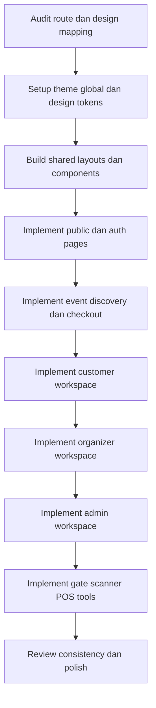

# Implementation Plan: Gelaran UI Integration

Dokumen ini merangkum rencana implementasi seluruh halaman aktual berdasarkan [`halaman-aktual.md`](halaman-aktual.md) dengan referensi visual dari folder [`stitch-designs`](stitch-designs).

## Tujuan

- Mengimplementasikan seluruh route aktual ke dalam aplikasi Next.js App Router yang sudah ada.
- Menyamakan UI dengan referensi Stitch secara konsisten.
- Menyusun pekerjaan dalam fase yang bisa dieksekusi bertahap oleh mode implementasi.
- Mengutamakan reuse komponen, konsistensi visual, dan keterhubungan dengan struktur route yang sudah ada di folder [`app/`](app/).

## Prinsip Implementasi

- Gunakan fondasi desain bersama terlebih dahulu sebelum mengerjakan halaman per halaman.
- Kelompokkan pekerjaan berdasarkan area produk: publik, auth, customer, organizer, admin, dan operational tools.
- Untuk tiap area, prioritaskan layout, shared components, lalu halaman detail.
- Gunakan desain Stitch sebagai referensi visual, bukan copy-paste literal HTML.
- Selaraskan hasil akhir dengan stack proyek saat ini, terutama Tailwind v4 dan App Router.

## Mapping Tingkat Tinggi

### Area Publik
- `/` → baseline visual dari [`stitch-designs/Gelaran_-_White_Theme_Landing_Page.html`](stitch-designs/Gelaran_-_White_Theme_Landing_Page.html)
- `/about` → baseline visual dari [`stitch-designs/About_Gelaran_-_Cultural_Curation.html`](stitch-designs/About_Gelaran_-_Cultural_Curation.html)
- `/contact` → baseline visual dari [`stitch-designs/Contact_Us_-_Gelaran.html`](stitch-designs/Contact_Us_-_Gelaran.html)
- `/become-organizer` → baseline visual dari [`stitch-designs/Become_an_Organizer_-_Gelaran.html`](stitch-designs/Become_an_Organizer_-_Gelaran.html)

### Auth
- `/login` → [`stitch-designs/Gelaran_-_Desktop_Login.html`](stitch-designs/Gelaran_-_Desktop_Login.html)
- `/register` → [`stitch-designs/Gelaran_-_Desktop_Registration.html`](stitch-designs/Gelaran_-_Desktop_Registration.html)
- `/forgot-password` → [`stitch-designs/Forgot_Password_-_Gelaran.html`](stitch-designs/Forgot_Password_-_Gelaran.html)
- `/reset-password` → [`stitch-designs/Reset_Password_-_Gelaran.html`](stitch-designs/Reset_Password_-_Gelaran.html)

### Event Discovery
- `/events` → [`stitch-designs/Gelaran_-_Events_Listing_Light_Mode.html`](stitch-designs/Gelaran_-_Events_Listing_Light_Mode.html)
- `/events/[slug]` → [`stitch-designs/Gelaran_-_Event_Detail_Light_Mode.html`](stitch-designs/Gelaran_-_Event_Detail_Light_Mode.html)
- `/organizers/[slug]` → [`stitch-designs/Organizer_Profile_-_SoloCurator.html`](stitch-designs/Organizer_Profile_-_SoloCurator.html)

### Customer Area
- `/dashboard` → [`stitch-designs/Gelaran_-_Customer_Dashboard.html`](stitch-designs/Gelaran_-_Customer_Dashboard.html)
- `/profile` → [`stitch-designs/Customer_Profile_Settings.html`](stitch-designs/Customer_Profile_Settings.html)
- `/wishlist` → [`stitch-designs/Wishlist_-_Gelaran.html`](stitch-designs/Wishlist_-_Gelaran.html)
- `/my-bookings` → [`stitch-designs/My_Bookings_-_Gelaran.html`](stitch-designs/My_Bookings_-_Gelaran.html)
- `/notifications` → [`stitch-designs/Notifications_-_Gelaran.html`](stitch-designs/Notifications_-_Gelaran.html)
- `/following` → desktop baseline dari [`stitch-designs/Following_-_Gelaran_Cultural_Discovery.html`](stitch-designs/Following_-_Gelaran_Cultural_Discovery.html), lalu disesuaikan responsively dengan pola mobile dari [`stitch-designs/Following_-_Gelaran.html`](stitch-designs/Following_-_Gelaran.html)

### Checkout
- `/checkout` → [`stitch-designs/Gelaran_-_Checkout_Desktop_Light_Mode.html`](stitch-designs/Gelaran_-_Checkout_Desktop_Light_Mode.html)
- `/checkout/success` → [`stitch-designs/Checkout_Success_-_Gelaran.html`](stitch-designs/Checkout_Success_-_Gelaran.html)
- `/checkout/pending` → [`stitch-designs/Checkout_Pending_-_Gelaran.html`](stitch-designs/Checkout_Pending_-_Gelaran.html)
- `/checkout/failed` → [`stitch-designs/Checkout_Failed_-_Gelaran.html`](stitch-designs/Checkout_Failed_-_Gelaran.html)

### Organizer
- `/organizer` → [`stitch-designs/Organizer_Dashboard_-_Gelaran.html`](stitch-designs/Organizer_Dashboard_-_Gelaran.html)
- `/organizer/settings` → [`stitch-designs/Organizer_Settings.html`](stitch-designs/Organizer_Settings.html)
- `/organizer/team` → [`stitch-designs/Organizer_Team_Management.html`](stitch-designs/Organizer_Team_Management.html)
- `/organizer/events` → [`stitch-designs/Organizer_Event_Listings.html`](stitch-designs/Organizer_Event_Listings.html)
- `/organizer/events/new` dan edit → [`stitch-designs/Create_Edit_Event_-_Gelaran_Curator.html`](stitch-designs/Create_Edit_Event_-_Gelaran_Curator.html)
- `/organizer/events/[id]` → [`stitch-designs/Organizer_Event_Details.html`](stitch-designs/Organizer_Event_Details.html)
- `/organizer/wallet` → [`stitch-designs/Organizer_Wallet_-_Gelaran.html`](stitch-designs/Organizer_Wallet_-_Gelaran.html)

### Admin
- `/admin` → [`stitch-designs/Gelaran_-_Admin_Dashboard_Desktop.html`](stitch-designs/Gelaran_-_Admin_Dashboard_Desktop.html)
- `/admin/analytics` → [`stitch-designs/Admin_Executive_Analytics.html`](stitch-designs/Admin_Executive_Analytics.html)
- `/admin/bookings` → [`stitch-designs/Admin_Bookings_Management.html`](stitch-designs/Admin_Bookings_Management.html)
- `/admin/categories` → [`stitch-designs/Admin_Category_Management.html`](stitch-designs/Admin_Category_Management.html)
- `/admin/events` → [`stitch-designs/Admin_Events_Management.html`](stitch-designs/Admin_Events_Management.html)
- `/admin/finance` → [`stitch-designs/Admin_Finance_Console.html`](stitch-designs/Admin_Finance_Console.html)
- `/admin/payouts` → [`stitch-designs/Admin_Payouts_Management.html`](stitch-designs/Admin_Payouts_Management.html)
- `/admin/refunds` → [`stitch-designs/Admin_Refund_Management.html`](stitch-designs/Admin_Refund_Management.html)
- `/admin/reviews` → [`stitch-designs/Admin_Review_Moderation.html`](stitch-designs/Admin_Review_Moderation.html)
- `/admin/settings` → [`stitch-designs/Gelaran_Admin_Settings.html`](stitch-designs/Gelaran_Admin_Settings.html)
- `/admin/users` → [`stitch-designs/Admin_User_Management_-_Gelaran.html`](stitch-designs/Admin_User_Management_-_Gelaran.html)
- `/admin/venues` → [`stitch-designs/Admin_Venue_Management.html`](stitch-designs/Admin_Venue_Management.html)
- `/admin/landing-page` → [`stitch-designs/Landing_Page_Manager_-_Gelaran_Admin.html`](stitch-designs/Landing_Page_Manager_-_Gelaran_Admin.html)

### Docs
- `/docs` dan sub-route docs → tidak mengikuti gaya admin/docs hub yang terpisah, tetapi diselaraskan dengan bahasa visual publik berbasis [`stitch-designs/Gelaran_-_White_Theme_Landing_Page.html`](stitch-designs/Gelaran_-_White_Theme_Landing_Page.html)

### Operational Tools
- `/scanner` → [`stitch-designs/Gelaran_Scanner_Utility.html`](stitch-designs/Gelaran_Scanner_Utility.html)
- `/gate` → [`stitch-designs/Gate_Management_Dashboard.html`](stitch-designs/Gate_Management_Dashboard.html)
- `/gate/access` → [`stitch-designs/Gate_Access_Terminal_-_Light_Mode.html`](stitch-designs/Gate_Access_Terminal_-_Light_Mode.html)
- `/pos` → [`stitch-designs/Gelaran_POS_Terminal.html`](stitch-designs/Gelaran_POS_Terminal.html)
- `/pos/access` → [`stitch-designs/Gelaran_POS_Access_-_Desktop_Light.html`](stitch-designs/Gelaran_POS_Access_-_Desktop_Light.html)

## Fase Implementasi

### Fase 1 — Fondasi desain dan styling global
- Samakan token warna, typography, radius, dan utility dasar dengan referensi Stitch.
- Review dan rapikan integrasi Tailwind v4 di [`app/globals.css`](app/globals.css).
- Tambahkan dukungan Material Symbols dan utility visual global yang reusable.
- Definisikan aturan spacing, card style, sidebar style, dan dashboard pattern yang konsisten.

### Fase 2 — Shared layouts dan reusable components
- Bangun komponen reusable untuk navbar, footer, section header, card event, stats card, badge, dan empty states.
- Bangun layout publik, layout auth, layout customer, layout organizer, dan layout admin.
- Tentukan komponen shell dashboard seperti sidebar, topbar, content wrapper, table shell, filter bar.

### Fase 3 — Public marketing pages
- Implementasi halaman home, about, contact, become organizer, terms, privacy dengan baseline visual utama dari [`stitch-designs/Gelaran_-_White_Theme_Landing_Page.html`](stitch-designs/Gelaran_-_White_Theme_Landing_Page.html).
- Turunkan tone visual publik yang lebih bersih, editorial, dan terang ke seluruh halaman marketing.
- Pastikan halaman-halaman publik punya responsive behavior yang baik.

### Fase 4 — Auth flow
- Implementasi halaman login, register, forgot password, reset password.
- Samakan visual hierarchy auth dengan referensi desktop/editorial style.
- Pastikan konsisten dengan form style proyek yang sudah ada.

### Fase 5 — Event discovery dan organizer public profile
- Implementasi listing event, detail event, FAQ event, organizer profile.
- Pastikan card, filter, hero media, ticket summary, dan related content konsisten.

### Fase 6 — Checkout flow
- Implementasi checkout utama dan status pages.
- Prioritaskan konsistensi antara summary panel, payment selector, dan success/pending/failed states.

### Fase 7 — Customer dashboard
- Implementasi dashboard customer, profile, wishlist, my bookings, booking detail, ticket detail, refund form, notifications, following.
- Gunakan komponen reusable dari fase sebelumnya untuk menghindari duplikasi.

### Fase 8 — Organizer workspace
- Implementasi organizer dashboard, event listings, event details, event editor, team management, settings, wallet, resource hub.
- Prioritaskan workflow inti organizer: melihat performa event, mengedit event, mengelola tim, menarik dana.

### Fase 9 — Admin workspace
- Implementasi admin dashboard, analytics, bookings, categories, events, finance, payouts, refunds, reviews, settings, users, venues, landing-page management.
- Gunakan shell admin yang konsisten untuk tabel, filter panel, metrics, dan side navigation.

### Fase 10 — Docs dan operational tools
- [x] Selaraskan `/docs` dan sub-route utama dengan bahasa visual publik/editorial yang sama, termasuk hero, stats, section framing, sidebar docs, dan content cards.
- [x] Refresh dokumentasi admin, organizer, dan customer agar merefleksikan workspace yang sudah diimplementasikan pada fase sebelumnya.
- [x] Rapikan terminal akses operasional yang masih tertinggal, terutama `/gate/access` dan `/pos/access`, agar konsisten dengan treatment status dan surface terbaru.
- [x] Lakukan sweep lanjutan untuk route operasional padat data `/gate`, `/pos`, `/scanner`, dan organizer Gate & POS management bila dibutuhkan refinement visual tambahan pada pass berikutnya.
- [x] Pastikan Fase 10 tetap fokus pada refinement, dokumentasi, dan konsistensi, bukan fitur produk baru.

## Todo Eksekusi

- [x] Audit semua route aktual dan pastikan ada mapping desain yang layak untuk tiap halaman.
- [x] Definisikan sistem desain bersama dari referensi Stitch ke token proyek.
- [x] Rapikan tema global Tailwind v4 dan utility visual di [`app/globals.css`](app/globals.css).
- [x] Bangun komponen shared untuk halaman publik.
- [x] Bangun komponen shared untuk dashboard shells.
- [x] Implementasi halaman publik utama.
- [x] Implementasi seluruh flow autentikasi.
- [x] Implementasi halaman event discovery dan organizer public profile.
- [x] Implementasi checkout flow lengkap.
- [x] Implementasi customer area.
- [x] Implementasi organizer area.
- [x] Implementasi admin area.
- [x] Implementasi docs dengan visual language publik.
- [x] Implementasi operational tools.
- [x] Review konsistensi visual, responsive behavior, dan reuse komponen.

## Mermaid Workflow

## Catatan Teknis

- Proyek saat ini sudah memiliki banyak route di [`app/`](app/), sehingga pendekatan terbaik adalah refactor visual bertahap, bukan membangun ulang route tree.
- Tailwind pada proyek ini sudah mengarah ke pola v4, jadi sumber perubahan styling utama kemungkinan berada di [`app/globals.css`](app/globals.css), bukan konfigurasi Tailwind klasik.
- Karena desain Stitch sangat beragam, perlu keputusan eksplisit untuk memilih varian final per area bila ada lebih dari satu kandidat desain.

## Keputusan Planning yang Sudah Ditetapkan

1. Baseline visual untuk halaman publik menggunakan [`stitch-designs/Gelaran_-_White_Theme_Landing_Page.html`](stitch-designs/Gelaran_-_White_Theme_Landing_Page.html).
2. Halaman docs akan mengikuti bahasa visual publik yang sama agar brand terasa konsisten.
3. Halaman dengan multi-referensi akan memakai satu baseline utama per area, lalu diperkaya dari desain Stitch lain bila memang relevan secara fungsional.

## Pertanyaan Tersisa untuk Handoff

1. Implementasi tahap awal sebaiknya mengejar visual parity yang kuat dengan struktur reusable lebih dahulu, lalu disempurnakan menjadi semakin pixel-close pada fase refinement dan review visual.
2. Route yang belum memiliki pasangan desain yang eksplisit boleh menggunakan pola layout terdekat dari area yang sama, selama tetap konsisten dengan baseline visual area tersebut dan tidak menyalahi hierarki informasi dari route terkait.
